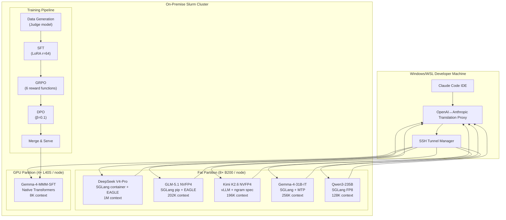

# HPC LLM Serving & Fine-Tuning

> **An inference playbook for running frontier open-source LLMs on bare-metal Slurm — getting maximum tokens/sec out of the hardware, and a translation layer that lets Claude Code drive them with zero Anthropic API traffic.**
>
> Serving 5+ frontier open-source models across **8× NVIDIA B200 + 4× L40S** with custom speculative decoding, an Anthropic↔OpenAI translation proxy, and end-to-end LoRA fine-tuning pipelines.


**This is a sanitized, educational version of my internal fleet. All company-specific hostnames, employee IDs, and proprietary data have been removed. For the real operational repo, I use my employer's private GitHub Enterprise instance.**

---

## ⚡ What This Covers

This is an **HPC inference playbook** — the practical knowledge for loading open-source LLMs onto a Slurm cluster and extracting maximum throughput from them, plus the glue that makes them drop-in replacements for hosted APIs. The headline chapters:

- **Loading open-source LLMs onto HPC**: model storage on scratch vs project quota, container (Apptainer) vs pip tradeoffs, per-model venvs, TP divisibility rules, `module load cuda/12.9.0`
- **Multi-backend serving**: SGLang (pip + Apptainer), vLLM, and native Transformers — when to pick which
- **Extracting maximum inference throughput**: speculative decoding (EAGLE 3-step MTP, FROZEN_KV_MTP drafters, ngram), `mem-fraction-static` tuning, `chunked-prefill-size`, attention-backend selection, TOKENSPEED_MLA, FP8/NVFP4/BF16 KV-cache tradeoffs
- **Anthropic translation proxy**: Anthropic Messages API ↔ OpenAI Chat Completions, so Claude Code (and `crush`, the Claude-LLM-specific builds) can drive self-hosted models with **zero Anthropic API traffic** — `reasoning_effort` mapping per engine, `max_tokens` caps, 52% tool-schema compression, re-prompt retry loops
- **Client tooling**: one-command launchers (`claude-glm`, `claude-kimi`, `claude-gm4`, …) that wire SSH tunnel + proxy + Claude Code together; `crush` for Claude-LLM-specific flows
- **LoRA fine-tuning pipeline**: SFT → GRPO → DPO with model-agnostic reward functions
- **Operational hardening**: QoS-by-reload-cost, zero-downtime hot-swap resubmit, ghost-allocation prevention, context safety nets, fairshare management

---

## 🏗️ Architecture



---

## 🚀 Production Fleet

| Model | Hardware | Throughput | Context | Engine | Key Optimizations |
|-------|----------|------------|---------|--------|-------------------|
| **DeepSeek V4-Pro** | 8× B200 | ~50–80 tok/s | **1M** | SGLang container | EAGLE 3-step MTP, `mem-fraction-static 0.82` |
| **GLM-5.1 NVFP4** | 8× B200 | **~167 tok/s** | 202K | SGLang pip | EAGLE + IndexCache, `chunked-prefill-size 131072`, modelopt_fp4 |
| **Gemma-4-31B-IT + MTP** | 2× B200 | **121–159 tok/s** (93% acceptance, 4.65 tok/step) | 256K | SGLang pip | FROZEN_KV_MTP drafter, triton attention backend |
| **Kimi K2.6 NVFP4** | 4× B200 | ~50–70 tok/s | 196K | vLLM pip | ngram speculation, MLA 512-rank KV cache |
| **Gemma-4-MMM-SFT** | 2× L40S | 23 tok/s | 8K | Native Transformers | Production domain agent, LoRA merged |
| **Qwen3-235B-A22B** | 4× B200 | ~65 tok/s | 128K | SGLang FP8 | triton MoE backend, TP=4 |

> **Note**: Models with expensive cold-boot times (>10 min, e.g. GLM-5.x DeepGEMM JIT compilation) are kept continuously available via rolling 3-day hot-swap resubmits. See [`docs/OPERATIONS.md`](docs/OPERATIONS.md) for the zero-downtime procedure.

---

## 🎯 Fine-Tuning Pipeline

End-to-end LoRA fine-tuning of **Gemma-4-31B-IT** into a domain-specific optimization agent:

```
Data generation (judge model) → SFT → GRPO → DPO → Merge → Serve → Eval
```

| Stage | Time (1× B200) | Config | Result |
|-------|----------------|--------|--------|
| **SFT** | ~5 min | LoRA r=64, 3 epochs | Domain-aligned base |
| **GRPO** | ~15–20 min | 4 generations, 6 reward functions | Structure + constraint rewards |
| **DPO** | ~10 min | β=0.1, sigmoid loss | Preference alignment |

**Eval result: 59% win rate vs Claude Sonnet 4.6** on domain-specific tasks.

---

## 🔌 Claude Code Integration (Zero Anthropic API Traffic)

A proxy translates Claude Code's native Anthropic Messages API into OpenAI Chat Completions. One-command workflows:

```bash
claude-dsp  # V4-Pro: tunnel + proxy + claude
claude-glm  # GLM-5.1: tunnel + proxy + claude
claude-kimi # Kimi K2.6: tunnel + proxy + claude
claude-gm4  # Gemma-4: tunnel + proxy + claude
```

**Proxy features:**
- `reasoning_effort` model-specific mapping (some engines reject `"none"`; others support full suppression)
- `max_tokens` caps preventing EAGLE scheduling degradation (4096 no-think / 8192 think / 16384 non-EAGLE)
- Context safety net with tiered compression and `chars/1.5` token estimator
- **52% tool schema simplification** — strips `$schema`, `additionalProperties`, format noise
- Re-prompt retry loop for invalid tool calls (max 3 retries)

---

## 📂 Repo Layout

```text
hpc-llm-serving/
├── README.md
├── .gitignore                        # Prevents credential leaks
├── .github/
│   └── workflows/
│       └── daily-contribution.yml    # Keeps the graph green
├── serving/
│   ├── serve-template-sglang.sh     # Generic SGLang launch script
│   ├── serve-template-vllm.sh       # Generic vLLM launch script
│   ├── serve-template-native.sh   # Generic native Transformers script
│   └── switch-model.sh              # Hot-swap helper
├── training/
│   ├── train-sft.py                 # LoRA SFT template
│   ├── train-grpo.py                # GRPO with reward functions
│   ├── train-dpo.py                 # DPO preference tuning
│   └── train-launcher.sh            # Slurm launcher template
├── proxy/
│   ├── server.py                    # Simplified proxy core
│   └── config/
│       └── reasoning-map.json       # Per-engine reasoning mapping
├── docs/
│   ├── ARCHITECTURE.md              # System design + tradeoffs
│   ├── SERVING_TUNING.md            # EAGLE, chunked prefill, mem-fraction
│   ├── PROXY.md                     # Claude Code ↔ self-hosted model patterns
│   └── DEPLOYMENT_LESSONS.md        # Container flags, TP math, OOM fixes
├── scripts/
│   ├── generate_sft_data.py         # Training data generation template
│   └── eval.py                      # Head-to-head eval harness
└── config/
    ├── lora-default.yaml            # Default LoRA hyperparameters
    └── grpo-rewards.yaml           # Reward function definitions
```

---

## 🏎️ Quick Start

```bash
# On HPC login node
sbatch --qos=1d --time=1-00:00:00 serving/serve-template-sglang.sh

# On local machine — tunnel + proxy + Claude Code
claude-glm    # or your custom launcher
```

> **Pick `--qos` by boot cost, not a blanket value.** QoS (Quality of Service) is Slurm's scheduling priority tier + wall-time ceiling. Higher QoS = faster scheduling at the cost of shorter max runtime.
>
> | Boot cost | QoS | `--time` | Examples |
> |-----------|-----|----------|----------|
> | > 10 min (expensive JIT, large model load) | `3d` | `3-00:00:00` | GLM-5.x (DeepGEMM ~15 min), MiniMax |
> | < 5 min (fast boot) | `1d` | `1-00:00:00` | Kimi, Gemma, V4-Pro, Qwen3 |
> | Training jobs | `7d` | `7-00:00:00` | SFT, GRPO, DPO |
>
> Always match `--time=N-00:00:00` to `--qos=Nd`. See [`docs/OPERATIONS.md`](docs/OPERATIONS.md) for the full decision matrix and zero-downtime hot-swap procedure.

---

## 📊 Key Docs

| Document | What it covers |
|----------|-------------|
| `docs/ARCHITECTURE.md` | Fleet table, all commands, paths — **start here** |
| `docs/PROXY.md` | `reasoning_effort` per engine, `max_tokens` caps, context trimming |
| `docs/SERVING_TUNING.md` | EAGLE configs, TOKENSPEED_MLA, chunked prefill, mem-fraction |
| `docs/DEPLOYMENT_LESSONS.md` | Container flags, TP divisibility, OOM fixes, ghost allocation prevention |
| `docs/OPERATIONS.md` | QoS-by-reload-cost, zero-downtime hot-swap resubmit, graceful shutdown |
| `docs/HPC_INVENTORY.md` | Manifest of what lives on the cluster — serve scripts, containers, venvs, model weights (pointers + sizes, no binaries) |

---

## ⚙️ Hardware Context (Example)

- **Cluster**: Slurm 24.11
- **Fat partition**: 8 nodes × 8× B200 (192GB each) = **64 GPUs, 12.3TB VRAM**
- **GPU partition**: 44 nodes × 4× L40S (48GB each) = **176 GPUs**
- **Python**: 3.11 in per-workload venvs
- **CUDA**: 12.9.0

---

## 🤝 Contributing

Issues and PRs welcome. This is a sanitized reference implementation — all company-specific data has been abstracted.

---

*Built with obsessive attention to throughput, correctness, and ship-it-today pragmatism.*
