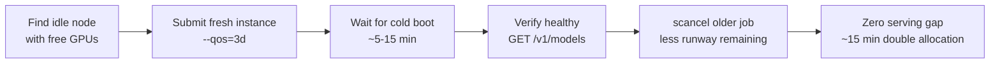

# Operations Guide

> **Scheduling strategy and zero-downtime procedures for multi-model Slurm fleets.**

This repo is an **HPC inference playbook** — loading open-source LLMs onto a Slurm
cluster, extracting maximum tokens/sec, and translating their APIs so Claude Code
(and `crush`, the Claude-LLM-specific builds) can drive them with zero Anthropic
traffic. This document is the **operational chapter** of that playbook: the
day-to-day decisions that keep a heterogeneous model fleet continuously available.

It covers how to pick the right Slurm QoS, how to resubmit expensive-to-boot models
without a serving gap, and how to avoid ghost GPU allocations. For the throughput
tuning, proxy translation, and loading chapters, see the rest of the `docs/` set and
the root `README.md`.

---

## QoS Selection by Reload Cost

### What Is QoS?

**QoS** (Quality of Service) is a Slurm scheduling tier that bundles a priority weight
with a wall-time ceiling. Higher QoS tiers schedule faster (higher priority) but cap
the maximum runtime shorter. Lower tiers wait longer but allow jobs to run for days.

The key insight: **QoS choice should be driven by model boot (reload) cost**, not by a
blanket rule. A model that takes 15 minutes to cold-boot should not be resubmitted daily
— the downtime and repeated JIT compilation waste far more time than the priority trade-off.

### Decision Matrix

| Boot cost | QoS | `--time` | Resubmit cadence | Typical examples |
|-----------|-----|----------|------------------|-----------------|
| **> 10 min** (expensive JIT, large model load) | `--qos=3d` | `3-00:00:00` | Every ~2.5 days, hot-swap | GLM-5.x (DeepGEMM ~15 min), MiniMax M3 (~5-8 min) |
| **< 5 min** (fast boot, small model) | `--qos=1d` | `1-00:00:00` | Daily | Kimi K2.6, Gemma-4, V4-Pro, Qwen3 |
| **Training** (long runs, no serving) | `--qos=7d` | `7-00:00:00` | Per-experiment | SFT, GRPO, DPO |

### Rules

1. **Always match `--time` to `--qos`.** If you set `--qos=3d`, you must also pass
   `--time=3-00:00:00`. Mismatched values cause Slurm to reject the job or silently
   apply the shorter of the two.

2. **Fairshare is unaffected by QoS choice.** QoS controls priority *within your
   fairshare allocation*; it does not consume fairshare faster. A 3-day QoS job and a
   1-day QoS job deplete your fairshare at the same rate per GPU-hour.

3. **Expensive-boot models get 3d, not 1d.** The old rule of "always use `--qos=1d`"
   is wrong for models like GLM-5.x: daily cold-boot costs ~15 min of downtime plus
   DeepGEMM JIT recompilation, which is pure waste. The 3-day window lets you hot-swap
   on day 2.5 with zero gap.

4. **Cheap-boot models stay on 1d.** If a model boots in under 5 minutes, the daily
   resubmit overhead is negligible and the higher priority of `--qos=1d` is worth it.

### Example

```bash
# GLM-5.x — expensive boot, 3-day window
sbatch --qos=3d --time=3-00:00:00 serving/serve-glm.sh

# Gemma-4 — fast boot, daily resubmit
sbatch --qos=1d --time=1-00:00:00 serving/serve-gemma4.sh

# SFT training — long run, 7-day window
sbatch --qos=7d --time=7-00:00:00 training/train-launcher.sh
```

---

## Hot-Swap Zero-Downtime Resubmit

### Purpose

When a model's Slurm wall-time is about to expire, you need a fresh instance running
before the old one is killed. This is a **same-model → fresh-same-model** operation:
the goal is to preserve availability of the current model, not to switch to a different
model.

This matters most for models with expensive boot times (>10 min). A naive
cancel-and-resubmit creates a 15+ minute serving gap.

### Procedure



**Step-by-step:**

1. **Find an idle node** with enough free GPUs for the model:

   ```bash
   sinfo -p fat -N --Format=NodeList,Partition,StateLong,GRES,GresUsed
   ```

   Look for a node in `idle` or `mixed` state with sufficient unallocated GPUs.

2. **Submit a fresh instance** with the appropriate QoS (3d for expensive-boot models):

   ```bash
   # Example: GLM-5.x on a fresh node, 3-day window
   sbatch --qos=3d --time=3-00:00:00 \
          --nodelist=fat-node-01 \
          serving/serve-glm.sh
   ```

3. **Wait for cold boot.** Monitor the job log:

   ```bash
   # Watch boot progress
   tail -f slurm-<jobid>.out

   # For DeepGEMM models, first boot takes ~15 min (JIT compilation, cached after)
   ```

4. **Verify the new instance is healthy** before proceeding. Probe the model endpoint
   and confirm it is serving and responding:

   ```bash
   # On the HPC login node, tunnel to the new node's port
   ssh -L <port>:fat-node-01:<port> user@hpc-login.example.com -N &

   # Probe — must return the model name and respond to a completion
   curl -s http://localhost:<port>/v1/models | jq '.data[0].id'
   curl -s http://localhost:<port>/v1/chat/completions \
     -H "Content-Type: application/json" \
     -d '{"model":"<model-name>","messages":[{"role":"user","content":"ping"}],"max_tokens":4}'
   ```

   **Do not proceed until the health check passes.** If the new instance fails to boot,
   debug it — the old instance is still serving.

5. **Kill the older job** — the one with less wall-time runway remaining. Compare
   `START_TIME` or remaining time via `squeue`:

   ```bash
   squeue -u $USER --format="%.10i %.20P %.8T %.10M %.10l %.20S"

   # Identify the older job (less time remaining) and cancel it
   scancel <older-jobid>
   ```

   **Key**: Kill by runway remaining, NOT by QoS number. Both instances may have the
   same QoS; what matters is which one will hit its wall-time first.

### What Happens During the Swap

- Both instances briefly coexist on **different nodes**, each with its own GPU allocation.
- The ~15 min overlap means **double GPU allocation** for that period — this is acceptable
  and expected. The cost of a 15-minute gap (users locked out, workflows interrupted) far
  exceeds the cost of 15 minutes of extra GPU time.
- The SSH tunnel and proxy must be updated to point at the new node. If your launcher
  script handles tunnel management automatically, simply re-run it. Otherwise, update
  the tunnel target manually.

### When to Hot-Swap

- **Scheduled**: At ~60-70% of wall-time elapsed (e.g., day 2 of a 3-day job), submit
  the replacement. This gives buffer for boot failures.
- **Reactive**: If a node goes unhealthy or a job is about to hit wall-time, hot-swap
  immediately.

### What Hot-Swap Is NOT

- It is **not a model switch.** You are replacing a running instance of model X with a
  fresh instance of model X. To change models, use the normal `switch-model.sh` flow.
- It is **not for cheap-boot models.** If a model boots in under 5 minutes, a simple
  cancel-and-resubmit is sufficient — the gap is negligible.

---

## Graceful Shutdown & Ghost Allocations

### Always `scancel` Before Resubmitting

When replacing a job, **always use `scancel`** to shut it down gracefully. Never let a
job hit its wall-time limit (which triggers `SIGKILL`).

```bash
# Correct — graceful shutdown
scancel <jobid>
# Wait a few seconds for cleanup, then submit the replacement
sbatch --qos=3d --time=3-00:00:00 serving/serve-glm.sh

# Wrong — wall-time SIGKILL causes ghost allocations
# (job runs until Slurm kills it at the deadline)
```

**Why it matters**: `SIGKILL` (exit code 137) does not give the GPU runtime a chance to
release resources. Slurm can leave GPU allocations "stuck" on the node indefinitely —
the node shows as `mixed` with GPUs allocated, but no job is running on it.

### Diagnosing Ghost Allocations

Symptoms:
- `sinfo -p fat -N` shows nodes as `mixed` with GPUs allocated
- `squeue -u $USER` shows zero jobs on those nodes
- New jobs stay `PENDING` with reason `Resources`

**Diagnostic steps:**

```bash
# 1. Check what's actually allocated on the node
scontrol show node fat-node-01 | grep -E "AllocTRES|Gres"

# 2. Check ALL jobs on the partition (not just yours!)
squeue -p fat --all --format="%.10i %.10u %.20N %.8T %.10M"

# 3. If no jobs show up, other teams' jobs may be the cause
#    (other users' jobs are invisible without --all)
```

**Resolution:**
- **Self-resolves** in 1-2 hours in most cases as Slurm reconciles state.
- If urgent, contact your cluster administrator to manually clear stale allocations
  or bump your job priority.
- **Prevention**: Always `scancel` — never let jobs hit wall-time `SIGKILL`.

### Other Teams' Jobs

On shared clusters, other teams' jobs can make nodes appear "ghost-allocated." Always
check `squeue -p <partition> --all` (not just `squeue -u $USER`) before assuming a
ghost allocation. What looks like a stuck GPU may simply be another user's running job.

---

## Summary

| Scenario | Action |
|----------|--------|
| Expensive-boot model nearing wall-time | Hot-swap: submit fresh 3d instance, verify, kill older |
| Cheap-boot model nearing wall-time | Cancel and resubmit with `--qos=1d` |
| Job hit wall-time (exit 137) | Check for ghost allocations, `scontrol show node` |
| Node shows GPUs allocated but no jobs | `squeue --all` to check other teams, then contact admin if truly stuck |
| New job stuck `PENDING (Resources)` | Other teams may be using GPUs; exclude that node or wait |

---

*For model-specific serve scripts and tuning parameters, see [SERVING_TUNING.md](SERVING_TUNING.md). For container deployment issues, see [DEPLOYMENT_LESSONS.md](DEPLOYMENT_LESSONS.md).*
